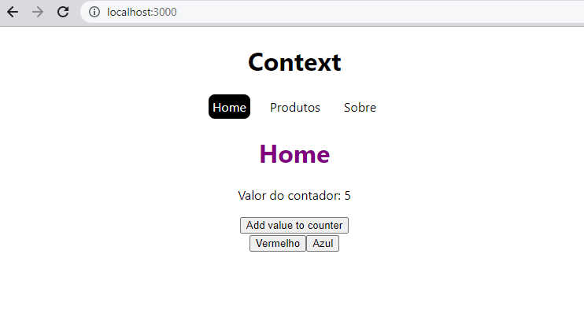

# Context API do react router

Baseado no curso do Matheus Bastitti (React do zero a maestria) - seção 9 (Context API do React)

Utilizamos o react-router-dom, useContext, useReducer, useState

Tela do aplicativo:
